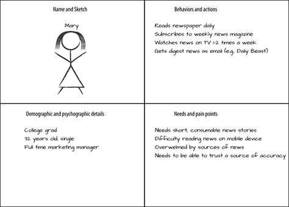

# Proto-Persona
A simplified persona to quickly ground a project without creating an exhaustive persona.
- Name and sketch—Pick a name that is memorable and include a sketch of what the person might look like or find an image representing them.
- Demographic and psychographic details—Include only those factors that are relevant to the subject at hand.
- Behaviors and actions—Briefly indicate the key behaviors the person takes in the field you’re focused on.
- Needs and pain points—Indicate what the person needs and what difficulties he or she encounters.

## References
- http://www.uxmatters.com/mt/archives/2016/09/mapping-experiences.php