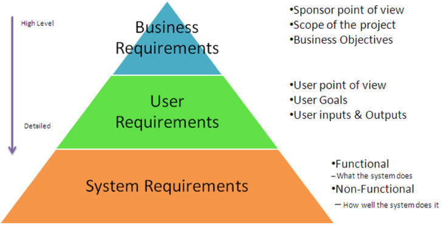

# User-Centered Requirements Document
In a project where there are already pre-conceived ideas on what the product's requirements should be. It is important not to start designing yet. Document detailed feedback that includes business and user opportunities, platform connection points, logical touchpoints to other products/services, and potential design goals. Beyond documenting feedback it is important to plan for data gathering to reinforce or refute assumptions and then map out the future vision of the product and it's requirements

