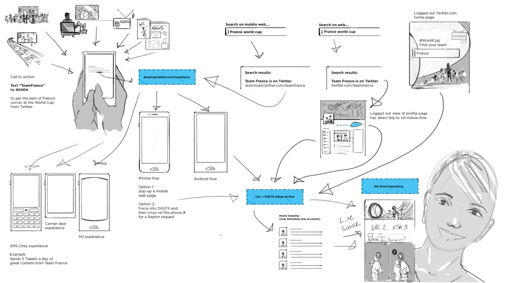

# Story Map
A new type of design document that shows the big idea of your product experience at a glance.
Halfway between a storyboard and a treasure map, it bundles the value and functional flow of your product with the delight people might feel at each step in your product. It sketches the UX flow without locking it down, and it delivers the gist of an idea and the emotional gestalt without prematurely belaboring the details.

## Example
