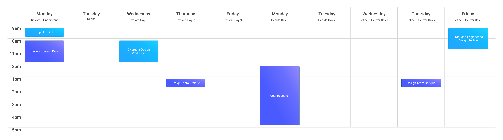

# Design Cycles Toolkit

This is a framework used to define the design process within a fast paced environment. Use as a decision framework for time spent on a project while setting clear expectations of what you hope to achieve with stakeholders. Can be used as a negotiating tactic on what the goals are for design.

#### Cycle Rules
1. Focus on one user group per cycle.
2. Tackle one hypothesis per cycle.
3. Hypotheses should be written before cycle kickoff.
4. Clear expectations of user needs and how they currently behave. If there are too many unknowns, then we must spend time doing a discovery cycle.
5. Sprints are intense and have a lot of activities required to be effective. Preserving working time is of the utmost importance.
6. Completely transparent from estimation, expectations, and outputs.
7. Use only for known industries and as an existing continuous in-house design process. *(If you're starting a whole new business, setting up a new design practice, or consulting, this process is not sufficient.)*


## The Design Cycle
A **2 Week Design Process** with a structured agenda that represents the 5 key moments of the Design Process.

### Typical Agenda
```
1. Day 1: Project Kickoff Meeting & Understand 
   1. Review existing research and definition artifacts (Journey Maps, UX Observation Database, etc...)
   2. Review existing Analytics and other quantitative data
2. Day 2: (Re)Define Problem and Update Definition Artifacts
   1. What we know. What we think we know. What we don’t know. 
   2. Reframe Problem & Refine Hypotheses
   3. Prep for divergent design workshop
   4. Recruit research participants
3. Days 3-5: Explore Divergent Approaches
   1. Divergent Design Workshop & Individual Sketching
   2. Document 3 broad approaches (Ex. User Flows & Architectures)
   3. Prototype
4. Day 6-7: User Validation & Decide Direction
   1. Document insights
   2. Provide direction recommendations based on user feedback
5. Days 8-10: Refine & Deliver Output
   1. Design Team Critique and Stakeholder Review
   2. Refine deliverables
```

### Typical Schedule


## How to Use Cycles for Projects

| Small Project                                         | Medium Project                  | Large Project                             |
| :---------------------------------------------------- | :------------------------------ | :---------------------------------------- |
| 1 cycle (2 weeks)                                     | 2 cycles (4 weeks)              | 3 cycles (6 weeks)                        |
| Immediately into detailed design                      | 1st cycle - architecture & flow | 1st cycle - broad conceptual evaluation   |
| Leverage only pre-existing data and research findings | 2nd cycle = detailed design     | 2nd cycle = architecture & flow           |
|                                                       |                                 | 3rd cycle = detailed design & refinements |


## Other Cycle Types

### Discovery Cycle
- 1 Week
- Focused on learning and completing research
- Key Output: Hypothesis and Design Cycle plan

### Mini Design Cycle (Design Sprint)
- 1 Week

### Extra Mini Design Cycle
- 1 day
- Facilitate group ideation


## Typical Project Uses

### Maximization
- Improve a known process (aka, New Feature)
- 2 or 3 Design Cycles
- Often starting first with a Discovery Cycle

### Optimization
- Improve a specific part of a known solution
- Optimize the user experience to create better outcomes
- Smaller scope
- 1 Design Cycle or 1 Mini Design Cycle

### Minimization
- Improve a specific part of known solution
- When creating *anything* is a dramatically better user experience than it's current state (aka, Design Blessing)
- Limited Design scope - Design effort would be best utilized in the future when trying to maximize or optimize
- Extra Mini Cycle

---

### Refinement Mini Cycle
- It's not uncommon that the design work in previously defined cycles is incomplete or not effectively accomplishing goals *(Remember we're moving at high speed - things can fall off the rails)*
- Iterate based off extension feedback that was received from previous cycle 
- 1 Mini Design Cycle

### New Product
- 3+ Design Cycles with one or more Discovery Cycles
- Big effort with many unknowns
- Pushing the boundaries of the Design Cycle Toolkit
- Please consider a deep design process that still leverages the advantageous of transparency and quick iterations with feedback.