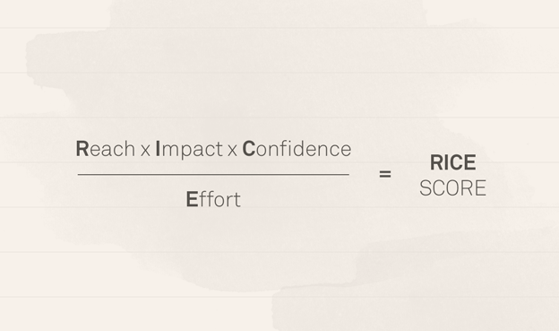
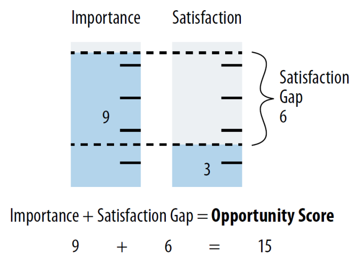
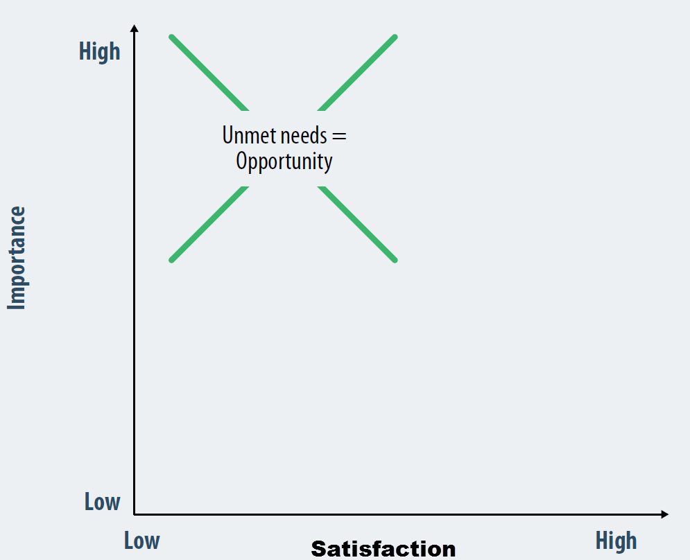
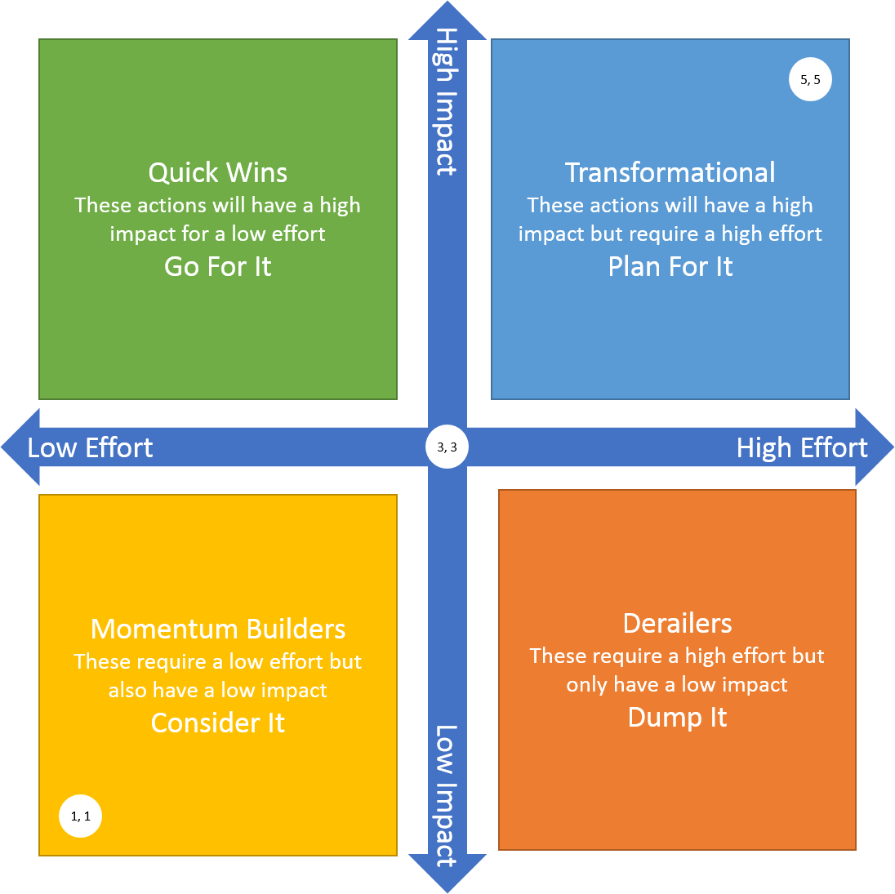
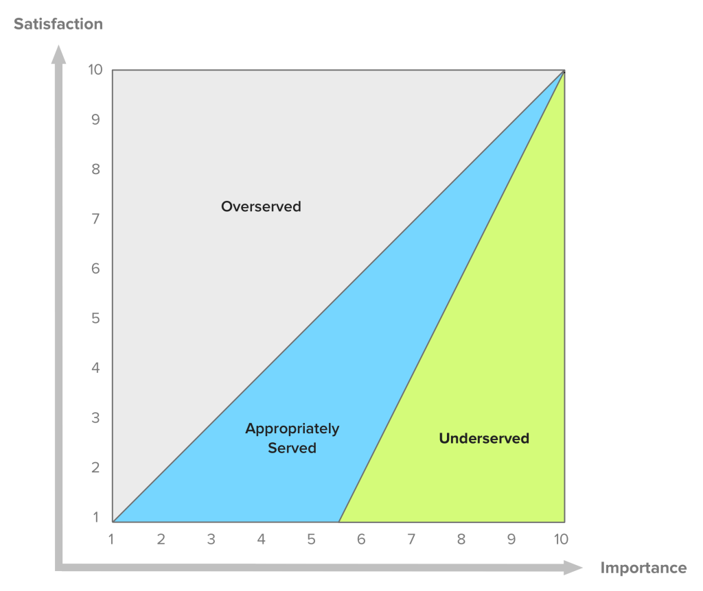
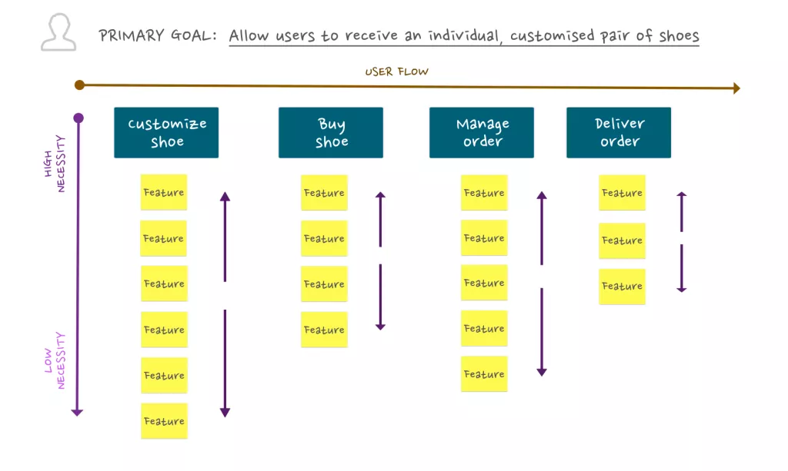

# Prioritization Frameworks

## Summary of Prioritization Attributes
1. Impact / Magnitude
2. Value
3. Reach / Size of Audience / Scale
4. Confidence
5. Effort / Complexity / Feasibility
6. Risk
7. Cost
8. Level of Customer Satisfaction
   1. Frequency of Complaints
9.  Importance
10. Urgency

## RICE
**Reach**
Estimation of how many people each project will affect within a given period. Measured in number of people/events per time period.
- Use quantitative metrics to determine potential audience

**Impact**
Estimation of the impact on an individual person. Measuring can be subjective, leverage scale as outlined: 3 = "massive impact", 2 = "high", 1 = "medium", 0.5 = "low", .25 = "minimal".
- Leverage user research to estimate impact

**Confidence**
The level of confidence you have about your estimates.  Measuring is subjective, leverage scale as outlined: 100% = "high confidence", 80% = "medium", 50% = "low"
- Use the other 3 measurements to help influence the confidence. The more clearly defined measurements of the other 3 increase the confidence.
	
**Effort**
Estimation of the total amount of time a project will require from all members of your team: product, design, and engineering. Measured in a number of "person-months" - the work that one team member can do in a month. Recommend sticking to whole numbers, unless something takes far less than a month.
- Combine all time estimates for all teams involved and figure out how many months it would take for a single person.
	
	
#### Scoring

## Opportunity Scoring (JBTD)
Prioritize jobs to be done by mapping out each job to its importance and the current satisfaction based on research.

#### Opportunity Diagram

## Other Matrixes

### Impact Effort Matrix
Sometimes as described as the Value Complexity Matrix.

### Satisfaction Importance Diagram

## Agile Story Mapping

## References
- https://blog.cayenneapps.com/2014/11/25/5-steps-to-building-minimum-viable-product-with-story-mapping/
- https://wildbit.com/blog/2016/05/11/how-we-built-a-product-vision-and-roadmap
- https://blog.intercom.io/rice-simple-prioritization-for-product-managers/ 
- https://experiencinginformation.com/2016/12/11/combining-mental-model-diagrams-and-jobs-to-be-done/
- Tony Ulwick https://en.wikipedia.org/wiki/Outcome-Driven_Innovation (Opportunity Algorithm)