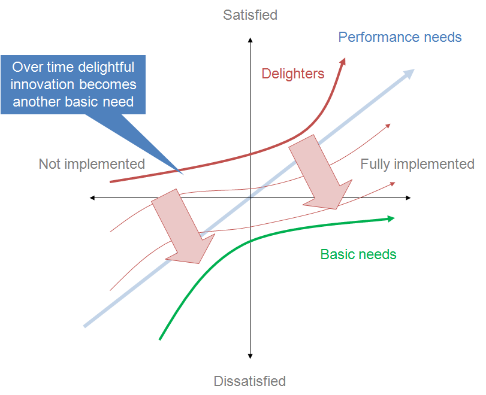

# Product Development References

## Kano Model
Product development model that visualizes customer satisfaction. It categorizes 5 customer requirements/preferences of every product and service.
1. Must-be Quality
2. One-dimensional Quality
3. Attractive Quality
4. Indifferent Quality
5. Reverse Quality

## Lean

## Agile

## SAFe Agile

## Extreme Programming (XP)