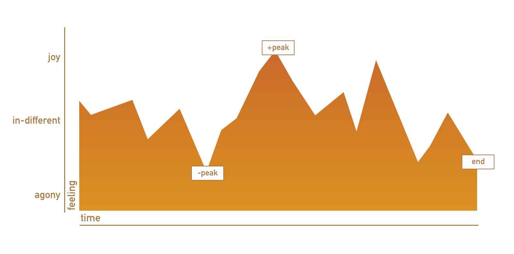

# Behavior Economics

## BJ Fogg's Behavior Model
Shows that three elements must converge at the same moment for a behavior to occur: Motivation, Ability, and Trigger. When a behavior does not occur, at least one of those three elements is missing.

## Nir Eyal's Hooked Model
- **Extrinsic Motivation** - external factors
- **Intrinsic Motivation** - internal factors
This means that someone can be driven to do something either by external factors, like the prospect of receiving a reward, such as money, or by internal factors, like the enjoyment derived from doing an activity.

## 	Persuasion Principles by Robert (Bob) Cialdini
- **Reciprocity (Rule of Reciprocation)** - If something is done for us, we tend to return the favor
- **Consistency** - We have a need for personal alignment with preexisting principles and values
- **Social Proof** - When unsure what to do, we look to the behavior of others to guide our actions
- **Liking** - We are more likely to comply with requests made by people that we like
- **Authority** - We are inclined to go along with someone’s suggestion if we think that person is a credible expert
- **Scarcity** - We tend to want what is less available

## Daniel Kahneman and Tversky
**System 1 and System 2 of thinking**
- System 2 is the more logical, rational system but tires quickly.
- System 1 leverage heuristics to jump to quick conclusions

**Experiencing Self Versus Remembering Self**
We tend to feel differently in the moment versus remembering it after the fact.
- Experiencing Self - your thoughts and feelings in the moment
- Remember Self - your thoughts and feelings of remember a moment

**Peak End Rule**
“The experiencing self is the one that answers the question: ‘Does it hurt now?' The remembering self is the one that answers the question: 'How was it, on the whole?' Memories are all we get to keep from our experience of living, and the only perspective that we can adopt as we think about our lives is therefore that of the remembering self.” In this sense we remember experiences as “peaks” and “endings.”

**Prospect Theory**
Describes how people choose between different options (or prospects) and how they estimate (many times in a biased or incorrect way) the perceived likelihood of each of these options.

Prospect theory explains the biases that people use when they make such decisions:
- Certainty
- Isolation Effect
- Loss Aversion

**Heuristics & Cognitive Biases Defined**
- Anchoring
- Availability
- Substitution
- Loss Aversion
- Framing
- Sunk-cost
- Certainty
- Isolation Effect

## Stephen Wendel 

**Attention / Intention Gap**

**CREATE Model**
- Cue. The user needs to think about something related to your product
- Reaction. The mind reacts is the thought appealing enough to do something with it or does the user dislike the thought.
- Evaluation. How much effort will the effort take and will I be rewarded
- Ability. The person must actually be able to act some actions might not be possible driving a car for example, or doesn’t like to run in the rain when a fitness bracelet gives a notification
- Time pressure. The user must have the time, or be pressurized enough to drop the current tasks or occupation.
- (Execute action). CREAT are preconditions required.

## Behavioral Economic Principles

**Action-Goals Gap** - People don’t actually do what they indend to do.

**Choice Architecture**- The careful design of the decision-making context strongly influences how people make choices.

**Friction Costs** - The harder an action is, the less likely it is that people will do it, no matter how much they want to.

**Default Bias** - People use the most automatic option to avoid complex decisions.

**Active Choice** - People make choices that better reflect their preferences when actively asked, or forced, to make a decision.

**Decision Paralysis** - When given many options, people make the easiest choice, which is often no choice at all.

**Social Norms** - People's behavior is impacted by what other people do.

**Reciprocity** - People have an inherent desire to help those who have helped them in some way.

**Gamification** - People like to play games! They will go to great lengths playing a game even if all they get are points.

**Saliency** - People's attention is drawn to what is novel and seems relevant to them.

**Availability Bias** - People give undue weight to what easily comes to mind: often vivid memories or recent events.

**Simplicity** - People prefer products and services when it is very easy to understand the purpose they serve and how they benefit them.

**Personalization** - People are more likely to respond to messages and services that are tailored to them.

## Now Versus Later Principles

**Hyperbolic Discounting / Present Bias** - People put unrealistically high value on the here and now and an unrealistically low value on the future.

**Lack of Self-Control** - People have a hard time deciding between doing what's good for themselves in the future and doing what feels good right now.

**Implementation Intentions** - People are more able to reach a goal if they create a concrete plan (and a plan B).

**What-the-hell Effect** - At the first sign of failure, people give up on getting back on track.

**You are What you Measure** - People repeat behaviors that are rewarded, regardless of whether those behaviors lead to success.

**Reward Substitution** - People can be motivated to work toward a distant, long-term goal by being rewarded for an associated immediate behavior.

**Pre-commitment** - People tend to follow through on goals (and avoid temptation) when they create consequences and roadblocks that help keep them on track.

**Goal Gradient** - People will work harder to achieve a goal as the goal gets closer.

**Planning Fallacy** - When planning, people underestimate the resources needed to meet their goals (such as time or level of commitment).

**Limited Attention** - People can only focus on a limited number of things at a time. This means we may miss important details.

**Tunneling** - When faced with an emergency, people can only focus on the emergency.

## Psychology of Money

**Opportunity Cost Neglect** - People tend to ignore what they give up when they make a choice.

**Relativity** - People evaluate choices by comparing them to what else is around.

**Sunk Costs** - People become psychologically invested in costs that they have already incurred, regardless of what the current and future costs and benefits are.

**Mental Accounting** - People categorize and treat money differently depending on where it came from and where it is going.

**Pain of Paying** - Some purchases are more painful than others, and people will try to avoid those types of purchases (incremental, cash, separated as a fee, and frequent.)

**Scarcity Mindset** - When resources are scarce, people pay a bandwidth tax that draws down cognitive resources and prevents them from focusing on anything else. (It distracts them)

**Payment for Effort** - People place greater value on services and products where they can see the amount of effort put into providing them.

**Endowment Effect** - People overvalue what they own.

**Loss Aversion** - People react to losses more strongly than gains and they try to prevent losses more than they try to make gains.

## References
https://www.ceros.com/resources/combining-ux-design-psychology-change-user-behavior/
https://en.wikipedia.org/wiki/Thinking,_Fast_and_Slow
https://uxmag.com/articles/how-to-help-your-users-take-action