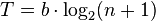
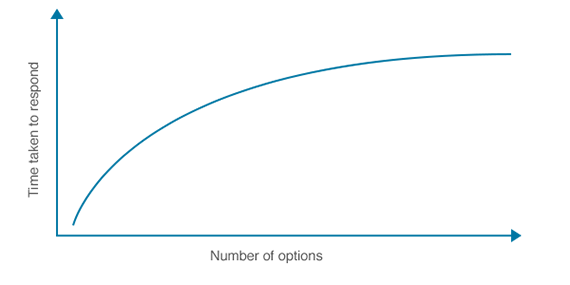
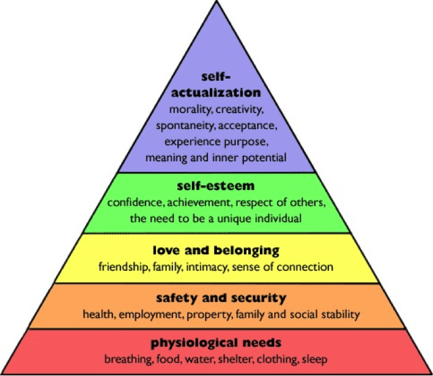

# Cognitive Psychology References
Cognitive psychology is the study of mental processes such as "attention, language use, memory, perception, problem solving, creativity, and thinking. 

## Memory

### Recall versus Recognition
Recall is more difficult and time consuming, while recognition is easier and faster.

### Von Restorff Effect (The Isolation Effect) 
People are more likely to remember something if it's distinct and stands out. Predicts that when multiple similar objects are present, the one that differs from the rest is most likely to be remembered.

### (George) Miller's Law
The average number of objects that can be held in working memory is seven.

### Chunking
In general usage, a ‘chunk’ means a piece or part of something larger. In the field of cognitive psychology, a chunk is an organizational unit in memory.

### Working Memory Vs. Short-Term Memory
Working memory and short-term memory are often used interchangeably, but they are slightly different. Working memory handles the processing of information, whereas short-term memory is more like a scratch pad for information that’s important but not important enough for long-term memory.

## Decision Making

### Hick's (Hick-Hymen) Law
Describes the time it takes for a person to make a decision as a result of the possible choices he or she has: *increasing the number of choices will increase the decision time logarithmically.*

### Choice Paralysis
http://sheenaiyengar.com/the-art-of-choosing/excerpt/
- 6 jam options Vs. 24 jam options
- People preferred more options but when having to choose only 1 they were more likely successful with less options.

Counter-point: https://www.theatlantic.com/business/archive/2013/08/more-is-more-why-the-paradox-of-choice-might-be-a-myth/278658/
- Having a choice is more important than no choice at all
- Not explicit but idea of few choices up front but then more layers of complexity introduced later (becoming an expert - Starbucks example) - progressive disclosure
- Context is everything - people need an appropriate number of choices to answer the desired question as best as possible

### Hobson's Choice
Is a free choice in which only one option is actually offered. The idea behind Hobson’s Choice is that your so-called ‘choice’ is to take or refuse the one option presented. In other words, you really don’t have much of a choice at all!
- When applied to UI, a single choice leads to make the choice or exit. When there are two options, it can lead more leads because the user will make a choice between the two.
- **Single-Option Aversion** - People are inclined to avoid choosing something when there is only a single choice. 

## Other

### John Sweller
- **Schema** - describes a pattern of thought or behavior that organizes categories of information and the relationships among them.
- **Cognitive Load** -  total amount of mental effort being used in the working memory.
  - Intrinsic - effort associated with a specific topic.
  - Extraneous - way information or tasks are presented to a learner
  - Germane - the work put into creating a permanent store of knowledge, or schema. 

### 3 Types of Load
1. Cognitive Load
2. Visual Load
3. Motor Load

*In order of most expensive on mental energy.*

### Ego Depletion
Refers to the idea that self-control and other mental processes that require focused conscious effort rely on energy that can be used up. When that energy is low (rather than high), mental activity that requires self-control is impaired.
Reference: Baumeister et al. - Ego Depletion (1998)
	
### Decision Fatigue
Refers to the deteriorating quality of decisions made by an individual, after a long session of decision making.

### Serial Position Effect
People recall the first and last of items in a series best, and the middle items worst. 
- Primacy effect = human tendency to recall items in the beginning
- Recency effect = position advantage due to seeing it last.
- Applied to design - items position first and last will likely be the most effective due to memory constraints.

### Zeigarnik Effect
People remember uncompleted or interrupted tasks better than completed tasks.

### Picture Superiority Effect
Concepts are much more likely to be remembered if they are presented as pictures rather than words.

#### Picture Encoding Theories
1. **Paivio's Dual Coding Theory** - Picture stimuli have an advantage over word stimuli because they are dually encoded; they generate a verbal and image code, whereas word stimuli only generate a verbal code.
2. **Nelson's Sensory Semantic Theory** - Pictures are perceptually more distinct from one another than are words, thus increasing their chance for retrieval. And pictures are also believed to assess meaning more directly than words.

### Inattentional Blindness (Perceptual Blindness)
A psychological lack of attention that is not associated with any vision defects or deficits, essentially an individual has a limited attention and can only notice so many things. Example: [The Monkey Business Illusion (Invisible Gorilla)](https://www.youtube.com/watch?v=IGQmdoK_ZfY)
	
**Selective Disregard** - ignoring what appears unrelated to the task at hand.

### Stimulus-response compatibility
The degree to which what people perceive is consistent with the actions they need to take. The less compatible the long the reaction time. 
Ex. Arrows that point to the next input field where the input fields are vertically positioned  - up/down arrows = faster reaction time; left/right = slower reaction time.

### Systemizer Vs Empathizer (Extreme Male Brain)
https://www.uxmatters.com/mt/archives/2014/07/gender-oriented-design-in-light-of-the-extreme-male-brain-model.php

### Maslov's Hierarchy of Needs

## References
https://www.nngroup.com/articles/chunking/
http://www.human-memory.net/types_short.html