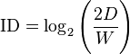
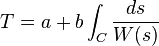

# Human Computer Interaction References

## Fitt's Law
Scientific law predicts that the time required to rapidly move to a target area is a function of the ratio between the distance to the target and the width of the target: increasing the distance or reducing the size of an object the more difficult the task becomes logarithmically.
*ID = index of difficulty; D = distance to target; W = tolerance or width of the target*

## Steering Law (Accot's Law)
A predictive model of human movement that describes the time required to navigate, or steer, through a 2-dimensional tunnel: the longer the tunnel and the more time needed for a human to move throughout - straight tunnel with a consistent width will have the best time.
T = time to navigate; a & b = constants;  C = path; W(s) = width of path at s

## Miller's Law
Productivity soars when a computer and its users interact at a pace (<400ms) that ensures that neither has to wait on the other.

## Jakob's Law
Users spend most of their time on other sites. This means that users prefer your site to work the same way as all the others sites they already know.

## Tesler's Law (The Law of Conservation of Complexity)
States that for any system there is a certain amount of complexity which cannot be reduced.

## Weber’s Law
The perceived change in stimuli is proportional to the original stimuli, together with the just noticeable difference, it means that the size of the just noticeable difference (the slightest change in stimuli that can be observed or noticed) is in proportion to the original stimuli.

## GOMS 
Cognitive structure that produces quantitative and qualitative predictions of how people will use a proposed system.
- Goals
- Operators
- Methods
- Selection Rules

## Aesthetic-Usability Effect 
Refers to users’ tendency to perceive attractive products as more usable. People tend to believe that things that look better will work better — even if they aren’t actually more effective or efficient.

## 3:1 Negative to Positive
According to psychologist Barbara L. Fredrickson, it takes three positive emotions to outweigh every negative one. Based on this, the Google design team set up two jars of marble to examine the costs and benefits. For every positive emotion that the design makes, they put a marble in the good emotion jar. However, if the design causes a negative emotion, they’ll put 3 marbles in the bad emotion jar. Their goal is to get an empty negative jar and a full positive jar.

## Seven Stages of Action
Constitutes four stages of execution, three stages of evaluation.
1. Forming the goal (execution)
2. Forming the intention (execution)
3. Specifying an action (execution)
4. Executing the action (execution)
5. Perceiving the state of the world (evaluate)
6. Interpreting the state of the world (evaluate)
7. Evaluating the outcome (evaluate)

- **Stages of Execution** - means to perform or do something.
- **Stages of Evaluation** - means to examine and calculate.
- **Gulf of Execution** - difference between the intentions and the allowable actions.
- **Gulf of Evaluation** - amount of effort that person must exert to interpret the physical state of the system and to determine how well the expectations and intentions have been met.

*Closely tied to my [Decision Action Model](../../Process/2_Define/decision-action-model.html)*

## References
https://www.nngroup.com/articles/aesthetic-usability-effect/
http://www.keirabui.com/google-androids-3-ux-design-principles-and-2-jars-of-marbles/