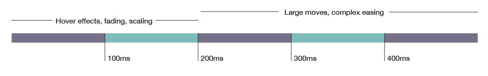

Animations are a key design component for modern experiences. When done effectively, animations enhance the intuitiveness, encourage adoption and engagement, and promote stronger emotional connections to the product.

## Use Cases
1. Orient \ keep the user oriented within the environment and provide focus
   1. Zoom-in
   2. Reinforce hierarchy 
   3. Fluid transition to transport user between navigational contexts
   4. Explain changes in arrangement of elements on a screen
   5. Introduce\expose something new to the environment
   6. Function Change - Same Location, New Action
2. Visual Hint - Hinting possible interactions or hint what to do next
   1. Direct Attention \ Highlight
   2. Visual Prompt
4. Provide feedback or context based on user behavior
5. Elicit an emotional response (Ex. Fun)
6. Provide system status
7. Technical Delay - An animation can be used to delay the user so that a service call can be completed.
8. Simulate an action or process

## Guidelines
Animations should be quick and never feel like we're intentionally delaying the user (this may seem counter to the technical delay). If a technical delay animation requires too much time, a different loading pattern must be used. 

When appropriate, make custom animation consistent with platform animations. If out-of-box animation is not included with our UI, than we must utilize similar animation techniques to have our animations fit within the platform.

Use animation consistently thought the app. We should never have two similar interactions that perform different animations.

As we continue to elevate our design, we intend to use animations more throughout the app without compromising on app performance.

**Reference [Response Times](response-times.md) for first principles**

## Reference
- [Functional UX Design Animations](https://www.smashingmagazine.com/2015/05/functional-ux-design-animations/)
- [The “Why” of Using Animation in Interaction Design](http://jake.ly/journal/animations.html)
- [How to Successfully Use Animations in Your Mobile App](https://yalantis.com/blog/-seven-types-of-animations-for-mobile-apps/)
- WWDC 2015: Designing with Animation
- [How Fast Should Your UI Animations Be](http://valhead.com/2016/05/05/how-fast-should-your-ui-animations-be/)